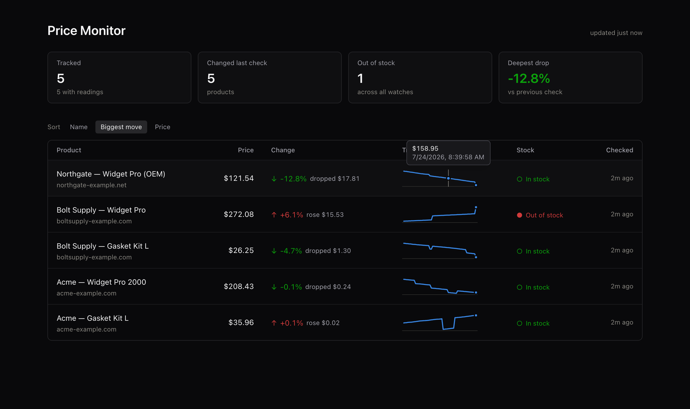

# Price Monitor

Tracks competitor prices and stock levels on a schedule, records the history, and alerts when something moves.

Point it at a list of public product URLs. It takes a reading a few times a day, stores every observation, and tells you when a competitor drops their price, raises it, or sells out.



---

## The problem

A small e-commerce operator competing on 20–200 SKUs has no idea when a competitor repriced. Checking by hand is an hour a day that nobody actually spends, so it doesn't happen — and a competitor undercutting you by 12% goes unnoticed for weeks.

The obvious build is a scraper that grabs a CSS selector off each page. That breaks constantly: selectors change on every redesign, and a monitor that silently reports stale prices is worse than no monitor.

## How it works

```
watches.json ──▶ robots check ──▶ throttled fetch ──▶ extract ──▶ diff vs last
                      │                                              │
                   refuse                                    record + alert
                                                                     │
                                                        data/history.json
                                                                     │
                                                            Express dashboard
```

## Design decisions

**Structured data first, selectors last.** Prices come from schema.org `Product` JSON-LD — the same markup Google reads for shopping results. Shopify, WooCommerce, BigCommerce, and Magento emit it by default, it's standardised, and it survives redesigns that shatter CSS selectors. Failing that, OpenGraph/microdata meta tags; failing *that*, a per-watch regex you configure explicitly. Extraction reports which strategy produced each reading, so a silent downgrade to the brittle path is visible rather than hidden.

**robots.txt is enforced, not consulted.** Every fetch checks the target's robots.txt first and refuses outright if disallowed — longest-match rule precedence, `*`/`$` wildcards, agent-specific groups overriding the wildcard group, and `Crawl-delay` honored when the site asks for more than our default. A 5xx on robots.txt is treated as "refuse", not "allow", since an unreadable policy isn't permission. The crawler identifies itself honestly in its User-Agent with a contact URL. **There is no bot-detection evasion here, deliberately** — if a site doesn't want to be read, the correct behaviour is to not read it.

**Politeness is structural.** Requests are spaced per-origin (2s default), not globally, so one slow host can't starve the others and no host ever sees a burst. Backoff on 429/5xx prefers the server's own `Retry-After` header over a guess. The default cadence is every 6 hours — four requests per product per day is invisible in anyone's access logs and plenty for pricing, which moves on the order of days.

**History is append-only; state is derived.** Every successful check appends an observation. "Current price" is computed as the newest row rather than stored in a separate field, so the summary can never drift out of sync with the history behind it. Writes go to a temp file and rename, so an interrupted run can't truncate months of accumulated readings.

**Price parsing handles both conventions.** `$1,299.00` and `1.299,00` are the same number. The parser decides which separator is decimal by which appears last, rather than assuming a locale.

**Alerts describe change, not state.** A webhook fires only on an actual price or availability transition — never on an unchanged reading — so the channel stays signal.

## Dashboard

Served locally at `http://localhost:3457`. Stat tiles for the headline numbers, then one row per product: current price, change since last check, a 14-day sparkline with a hover crosshair, and stock status.

Deltas and stock states pair a color with an arrow glyph and a text label. The green/red used for down/up is indistinguishable under deuteranopia (ΔE 4.1 measured against the chart surface), so color is never the only channel carrying the meaning.

## Usage

```bash
npm install

npm run add -- "https://competitor.com/products/widget" "Competitor A — Widget"
npm run check                 # one pass
npm run check -- --verbose    # include unchanged readings

npm run watch                 # long-running, every CHECK_INTERVAL_MINUTES
npm run dashboard             # http://localhost:3457
npm test
```

Watches live in `watches.json`:

```json
{
  "watches": [
    {
      "id": "a1b2c3d4",
      "label": "Competitor A — Widget Pro",
      "url": "https://example.com/products/widget-pro"
    },
    {
      "id": "e5f6a7b8",
      "label": "Competitor B — Widget Pro",
      "url": "https://example.net/shop/widget-pro",
      "priceRegex": "class=\"price\">\\$([0-9.,]+)"
    }
  ]
}
```

`priceRegex` is only needed for sites that publish no structured data — check whether it's required by running `npm run check` first and seeing whether a price comes back.

Optional `.env`:

```env
ALERT_WEBHOOK=https://hooks.slack.com/services/...
CHECK_INTERVAL_MINUTES=360
```

The webhook body is generic JSON (`{ text, watch, changes }`), which Slack, Discord, and Zapier all accept.

## Tests

```
npm test
```

20 tests on Node's built-in runner — no test dependency. Covers price parsing across locale formats, JSON-LD extraction (nested `@graph`, `AggregateOffer`, multi-offer products, malformed blocks), meta-tag and regex fallback ordering, and robots.txt rule precedence.

## Stack

Node 20+ · Express 5 · native `fetch` · Tailwind (CDN) · JSON files for storage — no database, no scraping framework, no headless browser.

## Scope

Reads public product pages only. It does not log in, does not bypass paywalls or bot protection, and does not touch anything robots.txt disallows. Sites that render prices purely client-side won't yield a reading — that's a deliberate limit, since the fix would be a headless browser and this stays a plain HTTP client.

Check the terms of service of any site you monitor. Being technically permitted by robots.txt isn't the same as being contractually permitted.
